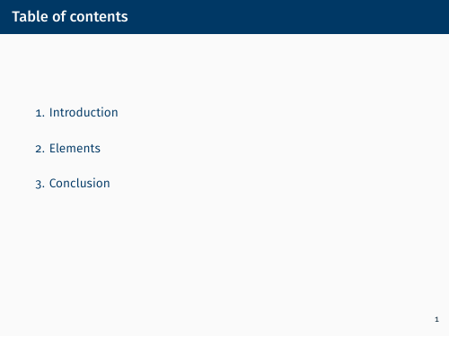
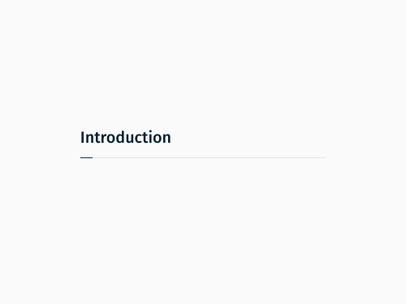
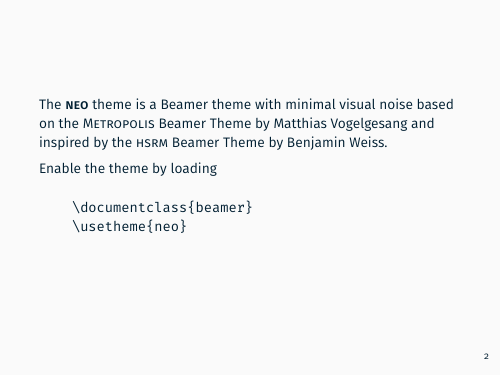
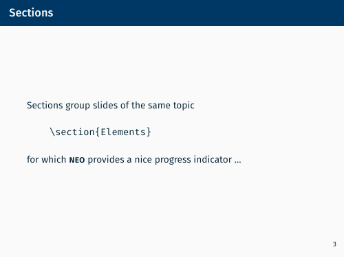

# i4neo Demo

This is a demo of the i4neo theme.
For a template for your own talks, see [i4neo-talk](https://gitlab.cs.fau.de/i4/tex/i4neo-talk).

Make sure to checkout the submodule as well, for example by using

	git clone --recursive https://gitlab.cs.fau.de/i4/tex/i4neo-demo.git

or -- for having the latest theme features -- by using

	git clone https://gitlab.cs.fau.de/i4/tex/i4neo-demo.git
	cd i4neo-demo
	git submodule update --init --recursive --remote

To build the [LaTeX demo](demo.tex), make sure you have a TeX distribution
(like [TeX Live](https://www.tug.org/texlive/)) and the util
[Latexmk](http://personal.psu.edu/jcc8//software/latexmk-jcc/) installed.

For Debian based distributions this can be achieved by executing

	sudo apt-get install make texlive-full latexmk

Afterwards simply run

	make demo.pdf

to create the PDF using *XeLaTeX* (predefined by the theme).

You can use different generators like *pdfLaTeX* (which requires FiraSans.sty)

	make demo-pdflatex

or *LuaLaTeX*

	make demo-lualatex

or explicitly the default *XeLaTeX* with

	make demo-xelatex

Although there are a few minor differences between the three generators above
regarding the typesetting, these should not be visible to the naked eye.

Having Pandoc installed you can build the [Markdown example](example.md) by
executing

	make example.pdf

